# The Groves — Inclusive Tax Calculator (Flutter + Hive + Firebase)

Production-quality Flutter application that reverse-calculates tax breakdowns from **inclusive retail prices** (final price paid by the customer, including taxes). The app targets Saudi Arabia-style scenarios:

- **Regular items:** 15% VAT only  
- **Tobacco products:** 100% excise tax on base + 15% VAT applied to (base + excise)

Supports mixed carts, per-item breakdown, grand totals, local persistence, and optional cross-device history sync using Firebase Authentication + Firestore.

---

## Key Features

### Core (Assessment Requirements)
- Add items by **inclusive price**
- Item type selection: **Regular** / **Tobacco**
- Per-item breakdown: **Base / Excise / VAT / Total Tax**
- Grand totals: **Total Inclusive / Base / Excise / VAT / Total Tax**
- Clear/Reset cart
- Input validation + error handling
- Material 3 UI with **dark mode support**

### Persistence
- Local persistence using **Hive**
  - Cart persistence
  - History persistence
  - Settings persistence (currency, tax config, theme mode)

### Bonus (Delivered)
- History screen + history detail view
- Configurable tax rates and multiplier via Settings
- Pie chart visualization (fl_chart)
- Firebase Auth (email/password)
- Firestore sync of history across devices (signed-in users)
- Unit tests for tax calculation logic

---

## Tax Formulas (Reverse Calculation)

### Regular Item (15% VAT)
Given inclusive price **P**:

- **Base** = P ÷ 1.15  
- **VAT** = P − Base  

### Tobacco (100% Excise + 15% VAT on Base+Excise)
Excise is 100% of base, and VAT is applied to (base + excise).

- Multiplier is configurable via Settings (assessment default: **2.30**)
- **Base** = P ÷ multiplier  
- **Excise** = Base × 1.00  
- **VAT** = (Base + Excise) × 0.15  
- **Total Tax** = Excise + VAT  
- Inclusive check: Base + Excise + VAT = P

> Note: Rates and multiplier are configurable via Settings for flexibility.

---

## Architecture & Code Quality

- **Flutter + Material 3**
- **Riverpod** state management (Notifier + Providers)
- Clean separation by feature:
  - `domain/` → business models and pure logic (TaxCalculator)
  - `data/` → persistence and repositories  
    - local: Hive stores
    - remote: Firestore remote history store
  - `presentation/` → screens, widgets, providers

The tax calculator logic is isolated and unit-tested.

---

## Firebase / Firestore Security

Firestore is locked down so users can only access their own records:

- Paths use: `/users/{uid}/histories/{historyId}`
- Access restricted to: `request.auth.uid == uid`
- Basic schema validation to prevent malformed writes

---

## Screenshots

### Cart / Inputs / Totals
- Cart (empty)  
  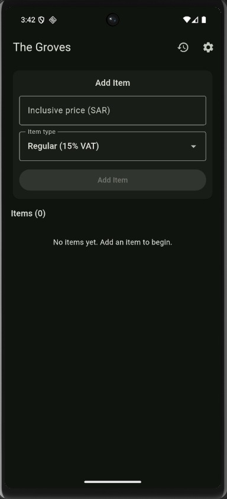

- Recent items  
  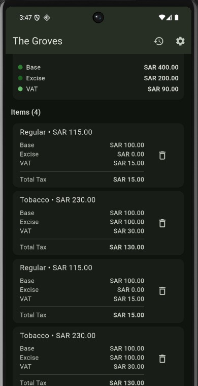

- Regular item example  
  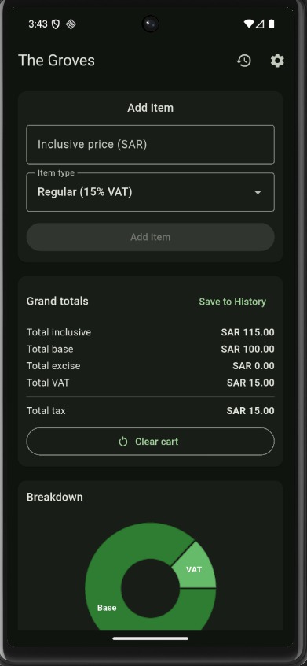

- Tobacco item example  
  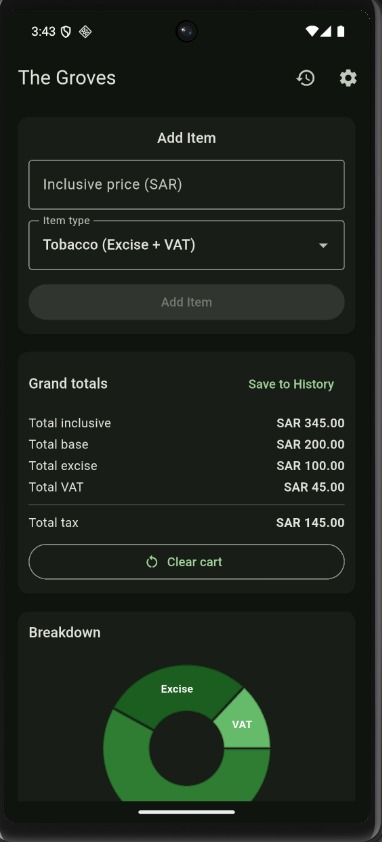

- Totals + Pie chart  
  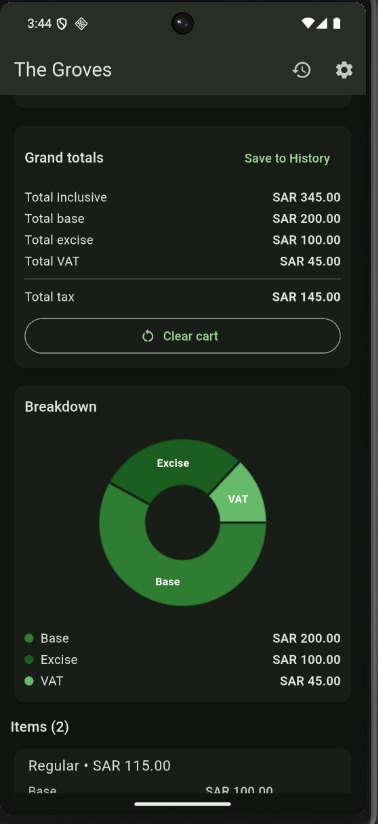

### History
- History list  
  

- History details (1)  
  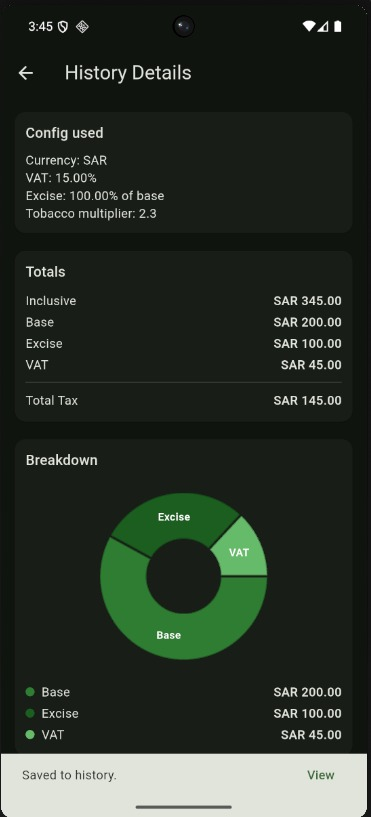

- History details (2)  
  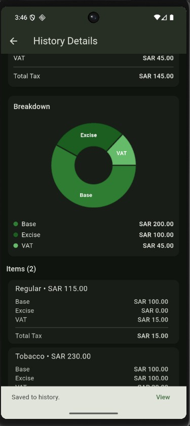

### Settings / Account / Theme
- Settings screen  
  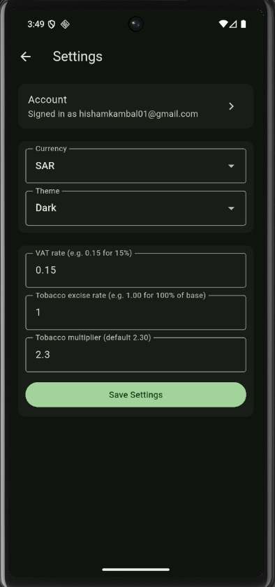

- Configurable tax rates  
  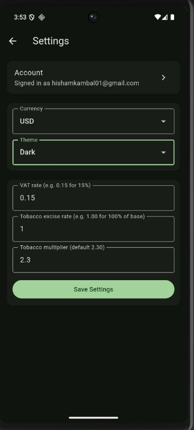

- SAR & USD  
  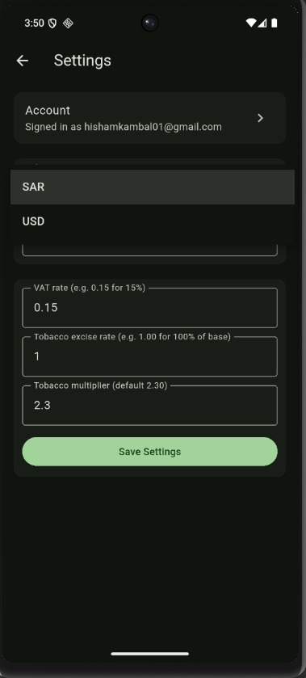

- Account screen (Auth)  
  

- Light mode examples  
  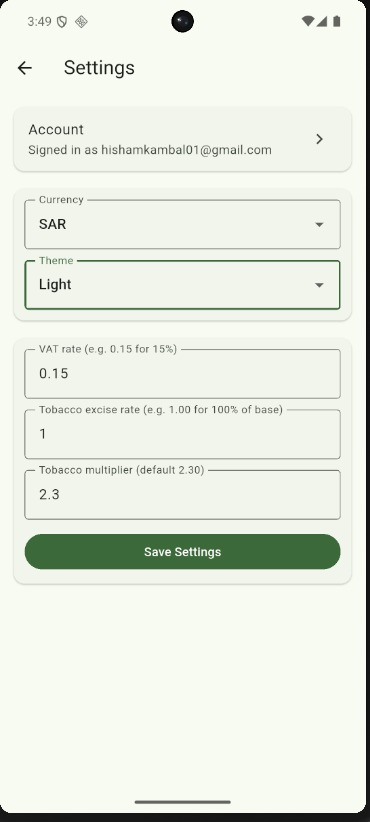
  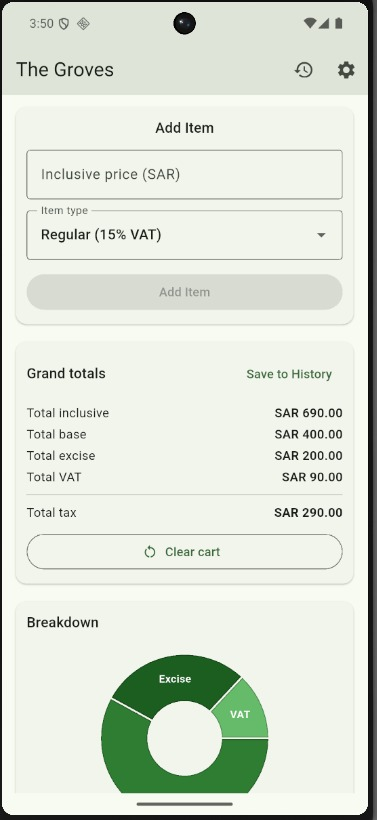
  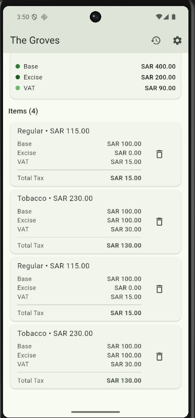

- Dark mode  
  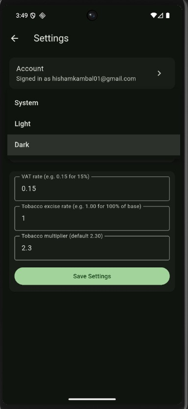

---
## Quick Review Guide (For Evaluators)

**Fastest way to evaluate the app:**

1. Download the release APK from the GitHub repository
2. Install on any Android device or emulator
3. Test the following flow:
   - Add a Regular item
   - Add a Tobacco item
   - Verify totals and pie chart
   - Save to history
   - Open history details
   - Sign in and verify history sync 

Alternatively, the app can be run from source using Flutter (instructions below).

## Setup & Run

### Prerequisites
- Flutter **3.38.x**
- Dart **3.10.x**
- Android Studio (for emulator)
- Firebase CLI + FlutterFire CLI (for Firebase integration)

### Install dependencies
- flutter pub get

### Analyze + test 
- flutter analyze
- flutter test

### Run on emulator example
- flutter emulators
- flutter emulators --launch Pixel_6
- flutter devices
- flutter run -d emulator-5554

## Demo / APK

Download the Android APK here:
https://github.com/HishamKambal/the-groves-tax-calculator/releases
